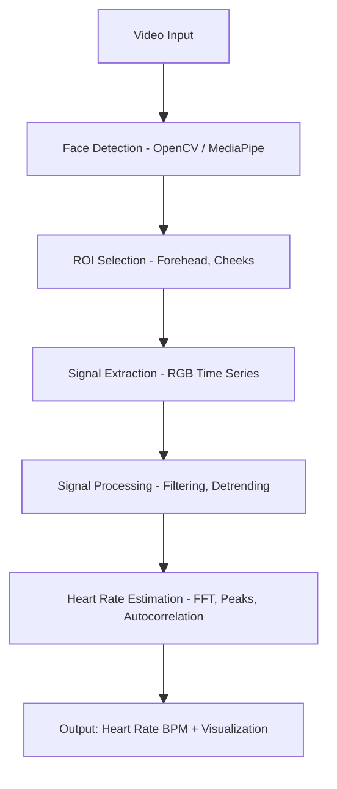

# Vitalight - rPPG Heart Rate Detection

A system that detects heart rate from facial video using subtle color changes in skin caused by blood circulation.

---

This project is structured according to the Spiral Model. Each iteration (cycle) consists of four stages:

1. Planning → Define objectives
2. Risk Analysis / Research → Identify uncertainties
3. Development / Prototyping → Implement and experiment
4. Evaluation → Analyze outcomes

After evaluation, the next cycle begins.

---

# VitaLight Flowchart

---

## Core Pipeline

1. **Face Detection** → Extract face region from video frames
2. **ROI Selection** → Select skin regions (forehead, cheeks)
3. **Signal Extraction** → Extract RGB time series from selected regions
4. **Signal Processing** → Apply filtering and noise reduction
5. **Heart Rate Estimation** → Use spectral analysis to find heart rate

---

## Core Libraries

- **OpenCV**: Video processing, face detection
- **MediaPipe**: Advanced face landmarks detection
- **NumPy**: Numerical computations
- **SciPy**: Signal processing (filters, FFT)
- **Scikit-learn**: ICA decomposition
- **Matplotlib**: Visualization and debugging
- **TensorFlow/Keras**: For potential deep learning models
- **Streamlit**: For web app deployment

---

## Project Iterations

### Iteration 1: Initial Implementation

**Planning**

- Explore UBFC-2 dataset format
- Implement face detection with OpenCV
- Extract signals from the forehead region
- Convert RGB values to time series
- Estimate HR using FFT

**Results:**    
    
    
    
- Worked initially on Kaggle; resolved attribute errors.
- Adjusted code to handle missing `hr` in `ground_truth.txt`.
- Early results were poor:
  - Estimated Heart Rate: 107.1 BPM
  - Confidence: 0.015
  - Comparison with Ground Truth:
  - Average Ground Truth HR: 36.4 BPM
  - Estimated HR: 107.1 BPM
  - Error: 70.8 BPM
  - Relative Error: 194.7%

**Evaluation:**

- Large errors (194% relative error). Decided to refine preprocessing and ROI strategy.
- Decided to switch to VS Code for development.

---

### Iteration 1.5: Improvements

- Multi-ROI signal extraction
- Advanced filtering (detrending, normalization)
- Multiple estimation methods (FFT, peaks, autocorrelation)
- Confidence-weighted combination
- Comprehensive visualization
- Robust error handling

**Results:**

- Combined Estimate: 103.3 BPM (Confidence: 0.584)
- Method Breakdown:
  - FFT → 89.0 BPM (Confidence: 0.021, unreliable)
  - Peaks → 112.4 BPM (Confidence: 0.855, most stable)
  - Autocorrelation → 78.3 BPM (Confidence: 0.313, partially consistent)
- Ground truth BVP signal could not be reliably parsed → no direct error comparison available

**Evaluation:**

- Accuracy could not be quantified due to missing ground truth processing
- More stable results, but overall accuracy remained limited.
- Confidence-weighted fusion improved stability compared to individual methods
- Next step: refine signal quality assessment and integrate more advanced algorithms (e.g., CHROM)

---

### Iteration 2: Advanced Signal Processing

**Planning:**

- Integrate CHROM algorithm
- Improve filtering and temporal stability
- Reduce error margin to acceptable levels

**Key Components:**

- CHROM Algorithm for robust signal construction
- Adaptive Filtering: bandpass, detrending, moving average
- Multi-ROI Processing for signal fusion
- Signal Quality Assessment to reject noisy data
- Temporal Consistency for smoothed HR estimates

**Results:**        
        
        
    

- Added CHROM method and multi-ROI processing
- Implemented ICA-based signal separation
- Advanced temporal filtering: moving average + bandpass + normalization
- Introduced new Welch method for HR estimation
- Signal quality assessment integrated into pipeline
- Method comparison framework extended
- Ground truth parsing fixed:
  - UBFC format error fixed (3 lines: BVP, HR, timestamps)
  - Direct HR reading from second line
  - Fallback to BVP-derived HR if missing
  - Better error messages for debugging
- Fixed filtfilt "padlen" error on short signals
- Improved accuracy vs. ground truth (95.3 BPM est. vs 102.0 BPM true, 6.5% error)

**Evaluation:**

- Accuracy significantly improved (error reduced to ~6.5%).
- Based on my literature review, I decided to experiment with the POS algorithm.
  - The paper “Effectiveness of Remote PPG Construction Methods: A Preliminary Analysis” compares eight rPPG methods (POS, LGI, CHROM, OMIT, GREEN, ICA, PCA, PBV).
  - Results show that POS demonstrates superior robustness in challenging conditions (motion and natural light), particularly for heart rate estimation.
- Next step: implement hybrid approaches, combining GREEN, CHROM, and POS for enhanced stability and accuracy.

---

### Iteration 3: Hybrid Methods & Optimization

_Current status: actively working here._

**Planning:**

- Combine multiple methods (POS, CHROM, GREEN) for robustness
- Optimize preprocessing and temporal stability
- Benchmark hybrid pipeline vs. individual algorithms

**Key Components:**

- Hybrid Algorithm Design: weighted combination of POS, CHROM, GREEN
- Dynamic Method Selection: switch algorithms based on signal quality
- Performance Benchmarking: cross-dataset evaluation

**Results:**

- **Evaluation:**

- ***

### Iteration 4: Machine Learning Enhancement

**Planning:**

- Integrate deep learning for generalization and temporal modeling
- Aim for research-grade accuracy

**Key Components:**

- **Data Collection**: UBFC-rPPG, PURE, etc.
- **Feature Engineering**: Frequency domain and statistical features
- **Deep Learning Models**:
  - CNN for ROI selection optimization
  - LSTM/GRU for temporal modeling
  - Attention mechanisms for adaptive region weighting
- **Model Training on Kaggle**: Leverage free GPU
- **Model Optimization**: Quantization, pruning for deployment

**Results:**

- **Evaluation:**

- ***

### Iteration 5: Real-time Implementation & Web App

**Planning:**

- Transition from research to real-time application
- Design a web-based and mobile-ready solution

**Key Components:**

- **Real-time Optimization**: Frame skipping, efficient processing
- **Streamlit Web App**: Clean, intuitive interface
- **Model Integration**: Seamless local model loading
- **Visualization**: Real-time plots and heart rate history
- **Error Handling**: Robust error management and user feedback

**Results:**

- **Evaluation:**

- ***

  **Summary:**

- The Spiral Model is well-suited for this project due to its risk-driven and research-oriented nature.
- Each iteration refines the system, balancing exploration (research) and consolidation (implementation).
- The project goal remains constant: Develop a system that extracts signals from facial video and reliably estimates heart rate.
- Methods, filters, and models evolve through iterative experimentation.
